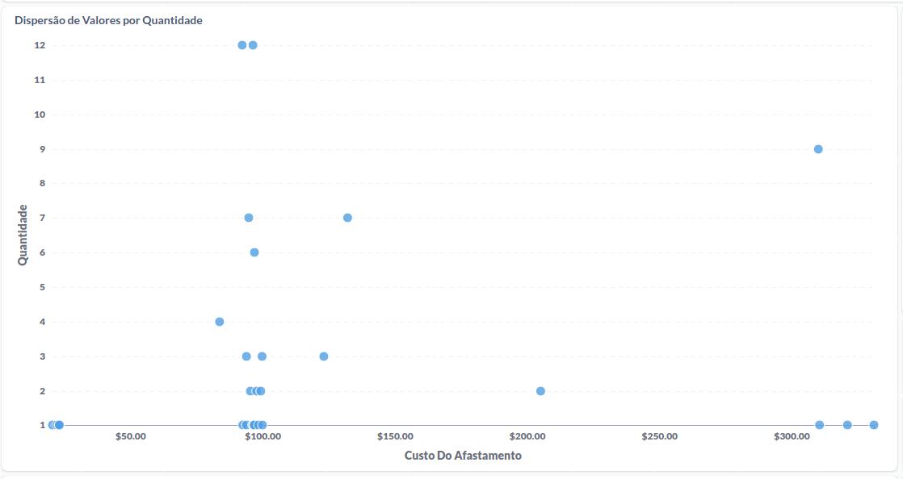

# Desafio_Metabase

## Desafio - BI

Contexto da Wellbe
Wellbe é uma plataforma empresarial de saúde e bem-estar que reduz custos de saúde para as empresas mensurando a efetividade de diversos benefícios e programas de saúde.

Wellbe Analytics - Integra diversos dados de saúde e oferece indicadores em tempo real para auxiliar na Gestão de Saúde, Gestão de Risco e Mensuração de ROI sobre os programas de saúde próprios e de terceiros.

Para que o gestor consiga tomar uma boa decisão é necessário que os dados sejam extraídos, transformados e carregados para uma melhor visualização e entendimento, assim podendo tomar a melhor decisão.

## Problema / Situação

Considerando que os custos de saúde têm aumentado muito e baixa qualidade de vida afetando a produtividade, as empresas buscam soluções de qualidade de vida que possam reduzir esses gastos em saúde(o plano de saúde é um benefício onde o reajuste anual é  baseado na utilização dos colaboradores). Com cada vez mais empresas usando a Wellbe é necessário garantir agilidade e acurácia no processo de população do banco de dados.

## Desafio
Realizar uma implementação completa dos dados, desde extração, transformação e carregamento dos dados para a construção de um dashboard.

## Ferramentas:

* Docker
* Mysql Server
* Mysql Workbench

## Tarefas:

* Preparar Ambiente 

    #### Criar banco de dados local e carregar tabela (https://drive.google.com/drive/folders/1t__6-5RiYufFrVM1XhrTb5_bFZTZAQEc?usp=sharing)

    #### Baixar e instaciar metabase localmente (https://www.metabase.com/docs/latest/installation-and-operation/running-the-metabase-jar-file)

	#### Instanciar metabase através do docker (https://www.metabase.com/docs/latest/installation-and-operation/running-metabase-on-docker)
	
* Montar queries que me respondam às seguintes perguntas:

* Considerando que o Líder está na linha acima de seus liderados

* Criar painel no metabase com as perguntas abaixo

* Criar filtros via metabase (departamento, data(intervalo), especialidade)

  
    
      

### Perguntas(construir em SQL)

* Qual departamento gastou mais em afastamentos?

    

    
    

* Quem é o líder do departamento que mais gastou?

    

    
    

* Trazer tabela de ocorrências por dia da semana

            
    

    
    

* Trazer o número de atestados acumulados ao longo do tempo(mês)

    

    
    

* Trazer a dispersão de valores por quantidade

    

### Links:

* Como instalar metabase localmente:
https://www.metabase.com/docs/latest/installation-and-operation/running-the-metabase-jar-file

* Como criar mysql localmente:
Ubuntu: ( Somente parte 2)  https://www.digitalocean.com/community/tutorials/como-instalar-a-pilha-linux-apache-mysql-php-lamp-no-ubuntu-18-04-pt
Windows: https://www.apachefriends.org/pt_br/index.html

# Conclusão

Para abordar o desafio proposto e aproveitando os dados fornecidos, inicialmente, considerei usar o modelo Star, uma modelagem relacional que facilita a visualização dos relacionamentos entre líderes e liderados. No entanto, dado que já recebi o script SQL com os dados, optei por seguir com a modelagem do script. As análises a seguir foram realizadas usando o Metabase.

Ao examinar os dados, observamos que o departamento "TECNICO SEGUROS II" possui a maior média de custo de afastamento, atingindo o valor de 331. É importante notar que, embora o departamento "ASSISTENTE DE IMPLANTACAO" tenha o maior número de registros de afastamentos, totalizando 14, sua média de custo é inferior.

Outro aspecto relevante é a média de custo por mês. O mês de abril de 2019 apresenta a maior média, atingindo 143,06, apesar de ter menos registros do que março e maio. No entanto, o departamento "TECNICO SEGUROS II" tem a maior média de custo, embora possua apenas um registro, o que pode distorcer a impressão dos valores. Analisando apenas os departamentos com mais de um registro, identificamos que o "ANALISTA INFORMACOES GERENCIAIS II" lidera com uma média de custo de 310,15 em março de 2019, mantendo a liderança no total, com 9 registros e uma média de 289,27.

No que diz respeito aos funcionários, ao aplicar o critério de considerar apenas aqueles com mais de 1 registro, "Anonimo 8" é o líder, com 10 registros e uma média de custo de 291,35. Essa liderança também se mantém ao analisar os valores mensais, com uma média de 310,15 em 03/19 e 278,83 em 04/19, ambos com base em 6 registros.

É importante notar que 11 funcionários, o que corresponde a 39% do total, possuem mais de um registro de afastamento. Apenas 5 funcionários apresentam uma média de custo superior à média geral, que é 127.

Todas as perguntas inicialmente solicitadas foram respondidas com sucesso por meio de consultas SQL e os gráficos gerados no Metabase.